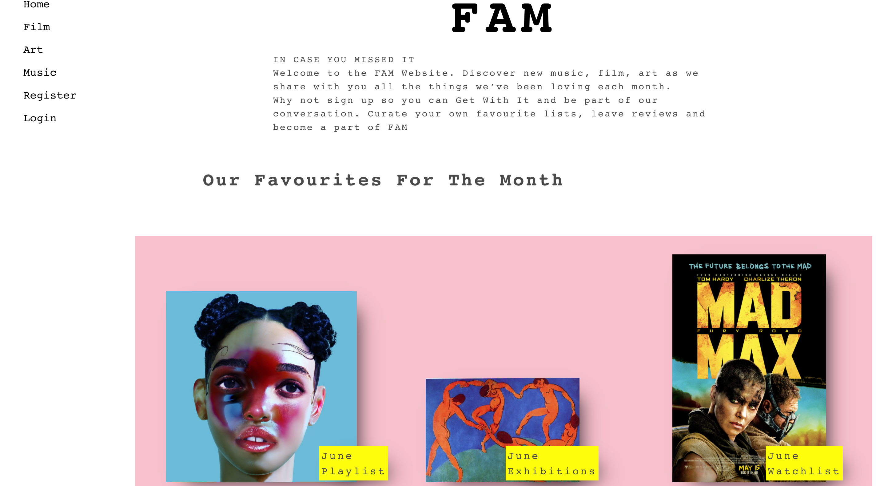

# sei-project-4

# Brief 
In 8 days I had to:

**Build a full-stack application** by making your own backend and your own front-end

**Use a Python Django API** using Django REST Framework to serve your data from a Postgres database 

**Consume your API with a separate front-end** build with React

**Be a complete product** which most likely means multiple relationships and CRUD functionality for at least a couple of models

**Implement thoughtful user stories/wireframes** that are significant enough to help you know which features are core MVP and which you can cut

**Have a visually impressive design** to kick off your portfolio up a notch and have something to wow future clients & employees. 

**Be deployed online** so it’s publicly accessible

**React Hooks** is optional for this project

# Technologies Used:

* Python
* Django
* SQL and PostgreSQL
* ReactJS
* React Hooks
* JavaScript
* HTML5
* SCSS 
* Insomnia
* GitHub
* Axios

# Contributors 

[Yarden Lawson](https://github.com/YBL123)

# Deployment 

This app has been deployed in Heroku and can be found [here](https://fam-ebyass.herokuapp.com/)

# Getting Started

Use the clone button to download the source code. In the terminal enter the following commands

`<!— To install all JavaScript packages listed in the package.json: —> `

`$ yarn`

`<!— To install Python packages: —> `

`$ pipenv install django `

`<! — Navigate into the shell —> `

`$ pipenv shell`

`<! — to install Python packages —>`

`$ createdb fam`

`<! — then to seed the database : —>`

`$ python manage.py loaddata categories/seeds.json`

`$ python manage.py loaddata genres/seeds.json`

`$ python manage.py loaddata mediums/seeds.json`

`$ python manage.py loaddata posts/seeds.json`

`<! — From the backend in your localhost:  —> `

`$ python manage.py runserver`

`<! — From the frontend in your localhost:  —> `

`$ yarn start`

`<! — Check the console for any issues and if there are are then check the package.json for any dependencies missing —>`

`<! Navigate to http://localhost:8000/> `

# FAM

Welcome to the FAM Website. Discover new music, film and art as we share with you all the things we’ve been loving each month.

Sign up to be part of our conversation. Curate your own favourite lists, leave reviews and become one of us here at FAM. 

Inspired by our similar interests, Yarden and I wanted to create an app that had the feel of an online publication. Using Python/Django for the backend and JavaScript/React for the front-end we built FAM 

#  Screenshot Walk Through

The user does not have to be logged in to browse the website for posts. When the user lands on the homepage, they view an automated newsfeed displaying the most recent posts.

