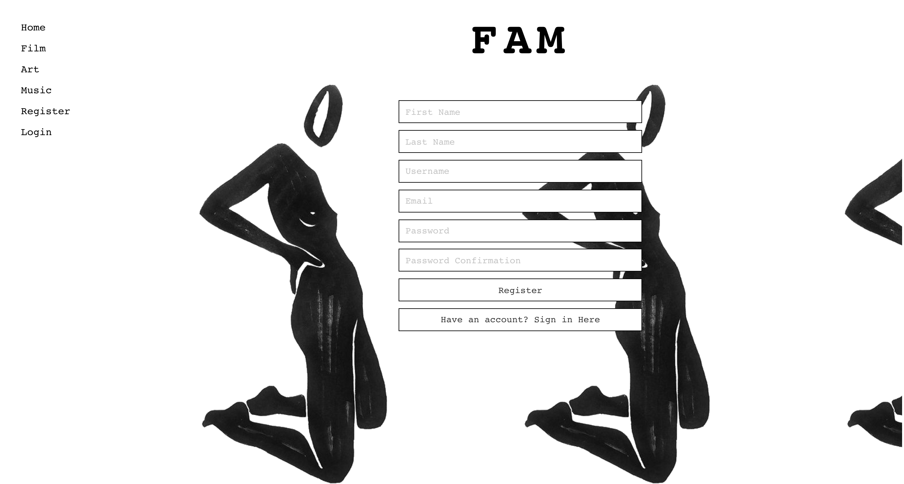
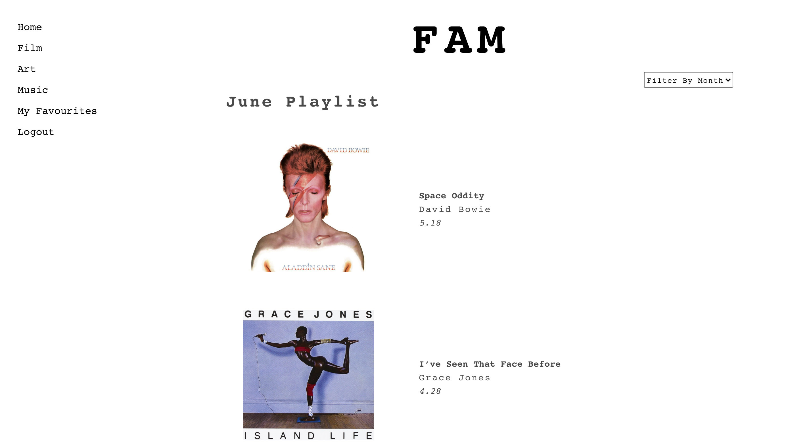
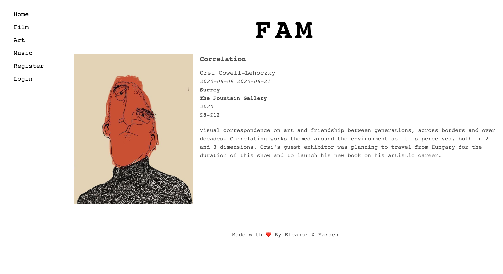
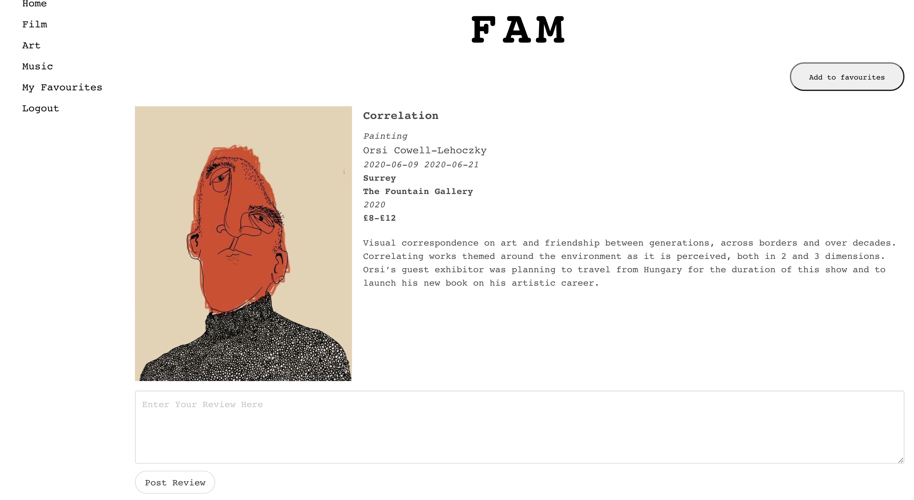
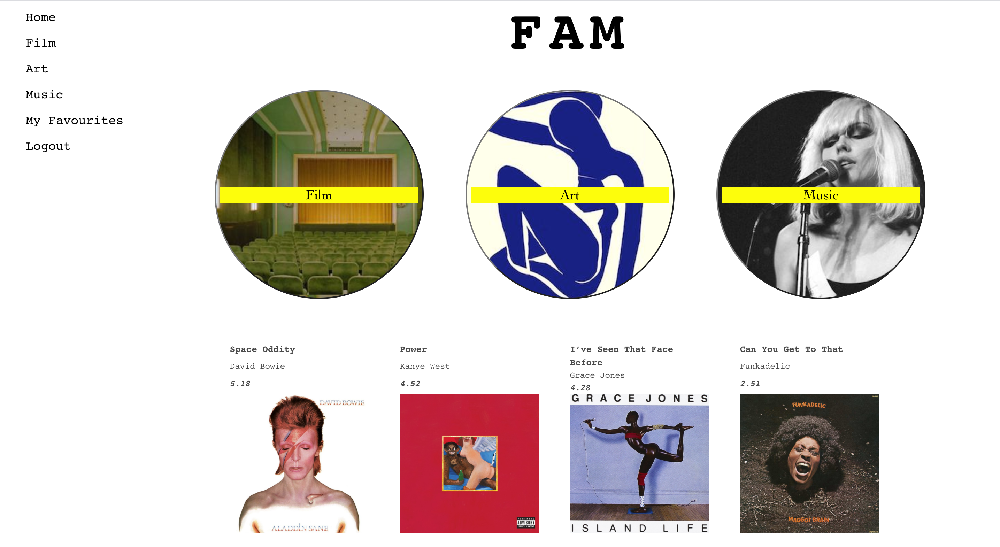
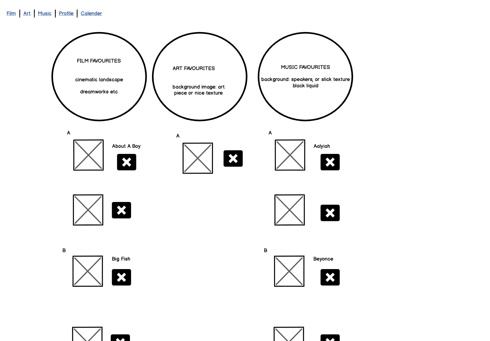
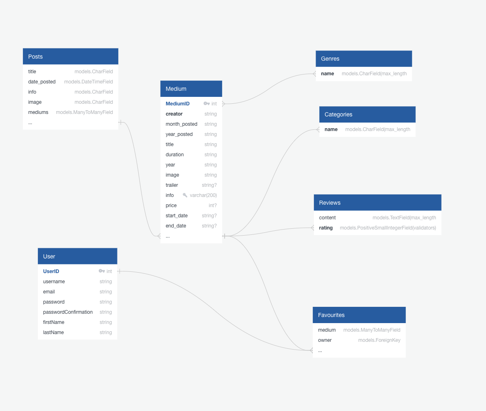

# Project 4: Full-Stack Django and React App

# Brief 

**Build a full-stack application** by making your own backend and your own front-end

**Use a Python Django API** using Django REST Framework to serve your data from a Postgres database 

**Consume your API with a separate front-end** build with React

**Be a complete product** which most likely means multiple relationships and CRUD functionality for at least a couple of models

**Implement thoughtful user stories/wireframes** that are significant enough to help you know which features are core MVP and which you can cut

**Have a visually impressive design** to kick off your portfolio up a notch and have something to wow future clients & employees. 

**Be deployed online** so it’s publicly accessible

**React Hooks** is optional for this project

# Timeframe 

8 days

# Technologies Used:

* Python
* Django
* SQL and PostgreSQL
* ReactJS
* React Hooks
* JavaScript
* HTML5
* SCSS 
* Insomnia
* GitHub
* Axios

# Contributors 

[Yarden Lawson](https://github.com/YBL123)

# Deployment 

This app has been deployed in Heroku and can be found [here](https://fam-ebyass.herokuapp.com/)

# Getting Started

Use the clone button to download the source code. In the terminal enter the following commands

`<!— To install all JavaScript packages listed in the package.json: —> `

`$ yarn`

`<!— To install Python packages: —> `

`$ pipenv install django `

`<! — Navigate into the shell —> `

`$ pipenv shell`

`<! — to install Python packages —>`

`$ createdb fam`

`<! — then to seed the database : —>`

`$ python manage.py loaddata categories/seeds.json`

`$ python manage.py loaddata genres/seeds.json`

`$ python manage.py loaddata mediums/seeds.json`

`$ python manage.py loaddata posts/seeds.json`

`<! — From the backend in your localhost:  —> `

`$ python manage.py runserver`

`<! — From the frontend in your localhost:  —> `

`$ yarn start`

`<! — Check the console for any issues and if there are are then check the package.json for any dependencies missing —>`

`<! Navigate to http://localhost:8000/> `

# FAM

Welcome to the FAM Website. Discover new music, film and art as we share with you all the things we’ve been loving each month.

Sign up to be part of our conversation. Curate your own favourite lists, leave reviews and become one of us here at FAM. 

Inspired by our similar interests, Yarden and I wanted to create an app that had the feel of an online publication. Using Python/Django for the backend and JavaScript/React for the front-end we built FAM 

#  Screenshot Walk Through

The user does not have to be logged in to browse the website for posts. When the user lands on the homepage, they view an automated newsfeed displaying the most recent posts.


If they already have an account the user can click Login or Register to create an account.



In the index page displays the most recent post along with all the top line relevant information for that medium, including image, title, artist, duration or location. Users can then filter through the database by  month using the dropdown menu in the top right corner of the page.



When a user clicks on a card they are taken to a show page where they can find out more about the work.



Logged in users see the same show page but with a lot more functionality, such as the ability to leave ratings and reviews and an ‘Add to Favourites’ button appears. If the user is the creator of the review they have the option to delete it.



The logged in user can view all their favourites lists, which are separated by medium.



# Functionality 

Users can:


* Register & Login
* View an automated newsfeed displaying the most recent posts 
* Search for posts by month 
* Browse each medium in more detail
* Create favourites lists, adding or removing different works easily
* Leave ratings and reviews in the show pages
* Delete ratings and reviews


# Process 

Once we had decided on an idea, we drew up a wireframe sketch of the pages in the frontend using Balsamiq. 



We used Quick Database Diagrams to visualise the backend and understand the relationships between the different models. This was an incredibly useful and crucial part of the process. 


We had originally planned to build 3 models for Film, Art and Music but the ERD model below helped us flesh out the relationships and it became clear we could be far more streamlined. 



We chose to build one Medium Model which linked to Categories using a foreign key for the one to many relationship and linked to Genres with a many to many relationship. 

We knew the importance of clear planning from previous projects and used daily stand ups to organise ourselves, set daily goals, help each other and hold each stay on target. 

By day 2 we were happy with the wireframes and could start work on the backend. As we were both relatively new to Python and SQL databases, we worked on this through pair programming. 

Once our backend was working and had been tested making API requests in Insomnia, we moved on to creating the front-end in ReactJS. I worked on the index pages, the dropdown feature, the homepage and the ‘add to favourites’ functionality. 

# Individual inputs

## Index Page 

I built the index pages with a dropdown filter function that filters posts by month. I was pleased with how I got this to work, using a ternary statement in the JSX and selectHasBeenUsed set to false in state, I was able to get the page to always show the most recent post, unless user had selected a specific month from the dropdown menu. 

```
<div>
        {selectHasBeenUsed ? (
          postsToRender.map(post => (
            <div className=“medium-index-wrapper” key={post.id}>
              <h2 className=‘index-page-h2’>{post.music_title}</h2>    
              {post.mediums.map((medium) =>
                medium.category === 3 ? (
                  <div className=‘medium-wrapper’ key={medium.id}>
                    <div className=“medium-info”>
                      <h1 className=‘index-page-h1-title’>{medium.title}</h1>
                      <h1 className=‘index-page-h1’>{medium.creator}</h1>
                      <h1 className=‘index-page-h1-duration’>{medium.duration}</h1>
                    </div>
                    <div className=“medium-img”> 
                      <Link to={`/mediums/${medium.id}`}>
                        
                      </Link>
                    </div>
                  </div>
                ) : /null/
              )}
            </div>
          ))


        ) : recentPost ? (
          <div className=“medium-index-wrapper”>
            <h2 className=‘index-page-h2’>{recentPost.music_title}</h2>
            {recentPost.mediums.map((medium) =>
              medium.category === 3 ? ( ///* music is category 3/
                <div className=‘medium-wrapper’ key={medium.id}>
                  <div className=“medium-info”>
                    <h1 className=‘index-page-h1-title’>{medium.title}</h1>
                    <h1 className=‘index-page-h1’>{medium.creator}</h1>
                    <h1 className=‘index-page-h1-duration’>{medium.duration}</h1>
                  </div>
                  <div className=“medium-img”>
                    <Link to={`/mediums/${medium.id}`}>
                      
                    </Link>
                  </div>
                </div>
              ) :
                /null/
            )}
          </div>
        ) : /null/}
      </div>
```

## Add to Favourites Functionality 

I became a lot more confident with React and it was really fun to push myself further by using React Hooks.  The code snippet below shows how I implemented the add to favourites functionality. There was a lot of double nesting to work through here and I particularly like my use case of `.find` to compare a whole object rather than return a boolean. This was necessary to check if a medium already existed inside a user’s favourites array. 

```
  useEffect(() => {
    /// if (!(medium && user)) return/
    /if/ (!medium) /return/ 
    /if/ (!user) /return/ 
    const getGenreOfMedium = medium.genres.map((item) => item) 
    const listOfFavourites = user.favourites.map((item) => item) || [] 
    const mediumId = medium.id 
    const isItAlreadyAFave = listOfFavourites.find((faveMedium) => faveMedium.medium.id === mediumId) 
    setMediumToMap(getGenreOfMedium)
    setIsFavourite(isItAlreadyAFave)
    setUpdateFavourites(listOfFavourites)
  }, [medium, user]) 
  
  const handleClick = /async/ (e) => {
    const mediumId = e.target.value
    /if/ (isFavourite) {
      const result = /await/ deleteFavourite(isFavourite.id)
      setUpdateFavourites(result.data)
      setIsFavourite(/null/)
    } /else/ {
      const res = /await/ addFavourite(mediumId)
      const medium = res.data
      setIsFavourite(medium)
    }
  }
```


# Wins and blockers 

The biggest blocker was understanding the asynchronous order of things. The code above is a massive achievement for me and something I have very proud of. Understanding useEffect and where to place functions in order for it to know about any changes made in state was a difficult thing to get my head around to start with. 

A huge win for this app is the responsive design. We really wanted our own unique stamp on this project so chose to avoid using any CSS frameworks. This decision meant that styling was incredibly fiddly but I am really pleased with the result. 

I absolutely loved how well Yarden and I worked together on this project. Our communication was seamless and we were so inspired and excited by each other’s attitudes to the project and our drive to learn. We plan to continue working together on side projects in the near future. 

Also a big shout out to Moment.js. The documentation was great and was a massive help when working on the filter by month functionality. 

#  Key Learnings 

Working on this project with Yarden really proved to me the value of making clear comments in my code. It was so helpful to have clear messages for one another about what we were doing and why and really helped cement concepts in my brain. 


# Future Improvements 

A previous project had taught me the dangers of setting an ambitious goal with a tight deadline. I found we had to scale back on some grand plans to ensure we created a really smooth and complete product. This absolutely felt like a passion project and is definitely something I want to continue working on and evolve into other side projects going forward.  
I planned to spend more time working with third party music APIs so that users can listen to our recommended songs for the month but sadly I ran out of time, so this is absolutely something I want to implement soon. 
I would also like to create a calendar view feature that displays the dates of upcoming exhibitions and release dates for film and music. 
